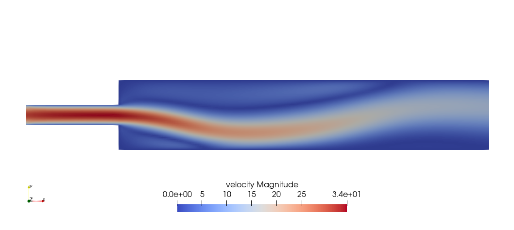
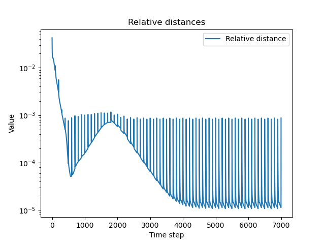
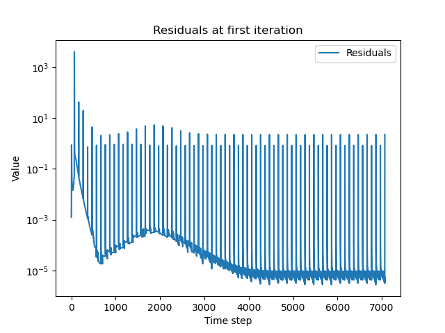

# Formal problem statement

The goal of this script is to study a symmetry-breaking bifurcation phenomena caused by the so-called Coandă effect in a sudden-expansion channel.

An introduction to the problem, as well as the strategies used to solve it, are presented in the following.

## The problem we want to solve
Let us consider the strong form of the incompressible unsteady Navier-Stokes equations:
```math
\begin{numcases}{}
    \frac{\partial\boldsymbol{u}}{\partial t} + (\boldsymbol{u}\cdot\nabla)\boldsymbol{u} - \mu\Delta\boldsymbol{u} + \nabla p = \boldsymbol{f}, \quad\forall(\boldsymbol{x}, t)\in\Omega\times\mathbb{R}^+, \\
    \nabla\cdot \boldsymbol{u}= 0, \quad\forall(\boldsymbol{x}, t)\in\Omega\times\mathbb{R}^+
\end{numcases}
```
where $\mu\in\mathbb{R}^+$ represents the kinematic viscosity of the fluid, $\boldsymbol{f}\in L^2(\mathbb{R}^+; [L^2(\Omega)]^d)$ is a given force per unit volume and $\Omega\subseteq\mathbb{R}^d$ in which $d = 2, 3$.


These equations describe the behaviour of an incompressible fluid of constant density $\rho\in\mathbb{R}^+$ and they need to be enhanced with initial conditions
```math
    \boldsymbol{u}(\boldsymbol{x}, 0) = \boldsymbol{u}_0(\boldsymbol{x}),\quad\forall\boldsymbol{x}\in\Omega,
```
where $\boldsymbol{u}_0$ is a given divergence-free vector field, and boundary conditions, either of Dirichlet type
```math
    \boldsymbol{u}(\boldsymbol{x}, t) = \boldsymbol{\varphi}(\boldsymbol{x}, t), \quad\forall(\boldsymbol{x}, t)\in\Gamma_D\times\mathbb{R}^+,
```
with $\boldsymbol{\varphi}\in [H^{1/2}(\Gamma_D)]^d$ given, or of Neumann type
```math
    \left(\mu\frac{\partial\boldsymbol{u}}{\partial\boldsymbol{n}}-p\boldsymbol{n}\right)(\boldsymbol{x}, t) = \left((\mu\nabla\boldsymbol{u})\cdot\boldsymbol{n}-p\boldsymbol{n}\right)(\boldsymbol{x}, t) = \boldsymbol{\psi}(\boldsymbol{x}, t),\quad\forall(\boldsymbol{x}, t)\in\Gamma_N\times\mathbb{R}^+,
```
in which $\boldsymbol{\psi}\in [L^2(\Gamma_D)]^d$ is also given.

Here $\Gamma_D\subset\partial\Omega$ and $\Gamma_N\subset\partial\Omega$ are portions of the boundary of $\Omega$ on which, respectively, Dirichlet or Neumann boundary conditions are imposed, with $\Gamma_D\cup\Gamma_N=\partial\Omega$, $\mathring{\Gamma}_D\cap\mathring{\Gamma}_N=\emptyset$ and $|\Gamma_D|, |\Gamma_N|>0$.

### Weak form of the Navier-Stokes equations
The weak form of the Navier-Stokes system, endowed with initial and boundary conditions, can then be written as follows: find
$\boldsymbol{u}\in L^2(\mathbb{R}^+; [H^1(\Omega)]^d)\cap C^0(\mathbb{R}^+; [L^2(\Omega)]^d)$ and $p\in L^2(\mathbb{R}^+; Q)$ such that
```math
\begin{numcases}{}
\begin{aligned}
    &\int_\Omega \frac{\partial \boldsymbol{u}}{\partial t}\cdot\boldsymbol{v}\, d\Omega + \int_\Omega \mu\nabla\boldsymbol{u}\cdot\nabla\boldsymbol{v} \, d\Omega + \int_\Omega [(\boldsymbol{u}\cdot\nabla)]\boldsymbol{u}\cdot\boldsymbol{v} \, d\Omega +\\
    &\quad - \int_\Omega p\nabla\cdot\boldsymbol{v} \, d\Omega = \int_\Omega \boldsymbol{f}\cdot\boldsymbol{v} \, d\Omega + \int_{\Gamma_N} \boldsymbol{\psi}\cdot\boldsymbol{v} \, d\gamma,  \quad \forall \boldsymbol{v} \in V,
\end{aligned} \\
\int_\Omega q\nabla\cdot\boldsymbol{u} \, d\Omega = 0, \quad \forall q \in Q,
\end{numcases}
```
in which the space $V = [H^1_{\Gamma_D}(\Omega)]^d = \{\boldsymbol{v}\in  [H^1(\Omega)]^d:\boldsymbol{v}\restriction_{\Gamma_D} = 0 \}$, and $Q=L^2(\Omega)$ if $\Gamma_N\neq\emptyset$, else $Q=L^2_0(\Omega)$.

### The Navier-Stokes equations in a channel
A common problem in fluid dynamics is the study of the behavior of a fluid flow in a channel $\Omega$.
Assume that the boundary of $\Omega$, which we call $\partial\Omega=\Gamma$, is partitioned into three different regions $\Gamma_{\text{inlet}}$, $\Gamma_\text{out}$ and $\Gamma_0$, each of them having non-negative measure and such that their interiors are pairwise disjoint. $\Gamma_\text{inlet}$ represents the subset of $\Gamma$ from which a fluid can flow inside the channel; $\Gamma_\text{out}$ represents the boundary from which the fluid can leave the channel, while $\Gamma_0$ represents the walls of $\Omega$, which are assumed to be rigid.

Formally, this corresponds to endowing the Navier-Stokes equations with stress free (Neumann) boundary conditions on $\Gamma_\text{out}$, no-slip (homogeneous) Dirichlet boundary conditions  on $\Gamma_{\text{wall}}$ and non-homogeneous Dirichlet boundary conditions on $\Gamma_{\text{inlet}}$, so that $\Gamma_\text{inlet}\cup \Gamma_\text{out}=\Gamma_D$, $\Gamma_\text{out}=\Gamma_N$, i.e. we impose that 

```math
\begin{cases}
\begin{array}{ll}
    \nabla\cdot \boldsymbol{u} = 0, & \quad \text{in } \Omega\times [0, T],\\
    \boldsymbol{u} = \boldsymbol{u}_{\text{inlet}}, & \quad \text{in } \Gamma_{\text{inlet}}\times [0, T],\\
    \boldsymbol{u} = 0, & \quad \text{in } \Gamma_0\times [0, T], \\
    -p\boldsymbol{n} + (\mu\nabla\boldsymbol{u})\cdot\boldsymbol{n} = 0, & \quad \text{in } \Gamma_{\text{out}}\times [0, T].
\end{array}
\end{cases}
```

### Bifurcation problems: a symmetry-breaking bifurcation
In CFD, difficulties might arise when the Reynolds number is high; in particular, there might be issue related to the uniqueness of the solution and transition of fluid flow stability.

These phenomena (as well as many other so-called _qualitative changes_) can be viewed within the framework of bifurcation theory.

Consider the general (strong) form of a parameterized PDE: for a given value of $\boldsymbol{\mu}\in\mathbb{P}\subset\mathbb{R}^p$, find $X\in\mathbb{X}$ such that
```math
F(X; \boldsymbol{\mu}_{n})=0, \label{abstractPDE}
```
with $F: \mathbb{X}\rightarrow\mathbb{X}'$.

We say that $\boldsymbol{\mu^{\ast}}\in\mathbb{P}$ is a _bifurcation point_ for the PDE \eqref{abstractPDE} if there exists a sequence $(X_n, \boldsymbol{\mu}_n)$, $X_n$ being not trivial, such that:
```math
    \begin{cases}
        F(X_n; \boldsymbol{\mu}_n)=0,  \quad\forall n\in\mathbb{N} \\
         (X_n, \boldsymbol{\mu}_n)\rightarrow (\bar{X},\, \boldsymbol{\mu^{\ast}}).
    \end{cases}
```

While a formal introduction to bifurcation theory (e.g. studying the relationship between bifurcation points and the implicit function theorem and so in) is not possible here for time reason, there are two main aspects related to bifurcations which are of practical importance:
- there exists a critical point $\mu^\ast$ after which the uniqueness of the solution is no longer guaranteed
- various branches of solutions might have different _stability_ properties, making them _physical_ or _unphysical_.


# Utilities
We begin by including all the necessary files:

```cpp
#include <deal.II/base/function.h>
#include <deal.II/base/logstream.h>
#include <deal.II/base/quadrature_lib.h>
#include <deal.II/base/quadrature_point_data.h>
#include <deal.II/base/tensor.h>
#include <deal.II/base/timer.h>
#include <deal.II/base/utilities.h>


#include <deal.II/distributed/grid_refinement.h>
#include <deal.II/distributed/solution_transfer.h>
#include <deal.II/distributed/tria.h>


#include <deal.II/dofs/dof_accessor.h>
#include <deal.II/dofs/dof_handler.h>
#include <deal.II/dofs/dof_renumbering.h>
#include <deal.II/dofs/dof_tools.h>


#include <deal.II/fe/fe_q.h>
#include <deal.II/fe/fe_system.h>
#include <deal.II/fe/fe_values.h>


#include <deal.II/grid/grid_generator.h>
#include <deal.II/grid/grid_refinement.h>
#include <deal.II/grid/grid_tools.h>
#include <deal.II/grid/grid_out.h>
#include <deal.II/grid/manifold_lib.h>
#include <deal.II/grid/tria.h>
#include <deal.II/grid/tria_accessor.h>
#include <deal.II/grid/tria_iterator.h>


#include <deal.II/lac/affine_constraints.h>
#include <deal.II/lac/dynamic_sparsity_pattern.h>
#include <deal.II/lac/full_matrix.h>
#include <deal.II/lac/precondition.h>
#include <deal.II/lac/solver_control.h>
#include <deal.II/lac/solver_gmres.h>
#include <deal.II/lac/sparsity_tools.h>

#include <deal.II/lac/petsc_block_sparse_matrix.h>
#include <deal.II/lac/petsc_solver.h>
#include <deal.II/lac/petsc_sparse_matrix.h>
#include <deal.II/lac/petsc_precondition.h>
#include <deal.II/lac/petsc_vector.h>


#include <deal.II/numerics/data_out.h>
#include <deal.II/numerics/error_estimator.h>
#include <deal.II/numerics/matrix_tools.h>
#include <deal.II/numerics/vector_tools.h>


#include <fstream>
#include <iostream>
#include <sstream>
#include <vector>
```

Now, we define a namespace enclosing all the code which is written (both the NS class and its helper functions):

```cpp
namespace coanda
{
  using namespace dealii;
```

Now we define a few helpers which are going to be needed in the NS class.


The following function is needed to save the vectors which help us keeping track of the bifurcating behaviour of the solution (more on that in the following).
The vectors are saved in .csv format.


```cpp
  void save_vector(const std::vector<double>& vec, const std::string& filename)
  {
    try
    {
      std::ofstream out(filename);

      if (!out) 
        throw std::ios_base::failure("Error opening file for writing.");
    
      for (size_t i = 0; i < vec.size(); ++i)
      {
        out << vec[i];
        if (i != vec.size() - 1) out << ",";
      }
      out.close();
    }

    catch (const std::exception& e)
    {
      std::cerr << "It was not possible to save the vector to a file named "
                << filename << ". Error: " << e.what() << std::endl;
    }
  }
```
## `Time` class and utilities
We define the `Time` class, which carries out the following tasks:
  - keep track of the current time 
  - define the time $T_{\text{end}}$
  - save the time stepsize $\Delta t$ (assumed to be constant)
  - specify whether the current time is marked for saving the solution
  - specify whether the current time is marked for mesh refinement

```cpp
  class Time
  {
  public:
    Time(const double time_end, const double delta_t, const double output_interval, const double refinement_interval)
      : timestep(0),
        time_current(0.0),
        time_end(time_end),
        delta_t(delta_t),
        output_interval(output_interval),
        refinement_interval(refinement_interval)
    {}
```

The following functions are pretty self-explanatory and are not commented in detail.

```cpp
    double current() const { return time_current; }
    double end() const { return time_end; }
    double get_delta_t() const { return delta_t; }
    unsigned int get_timestep() const { return timestep; }


    bool time_to_output() const;
    bool time_to_refine() const;
    void increment();


  private:
    unsigned int timestep;
    double time_current;
    const double time_end;
    const double delta_t;
    const double output_interval;
    const double refinement_interval;
  };


  // Returns true if the current time is marked for output 

  bool Time::time_to_output() const
  {
    unsigned int delta = static_cast<unsigned int>(output_interval / delta_t);
    return (timestep >= delta && timestep % delta == 0);
  }


  // Returns true if the current time is marked for mesh refinement

  bool Time::time_to_refine() const
  {
    unsigned int delta = static_cast<unsigned int>(refinement_interval / delta_t);
    return (timestep >= delta && timestep % delta == 0);
  }


  
  // Function to update the current time and the timestep

  void Time::increment()
  {
    time_current += delta_t;
    ++timestep;
  }
```

## Boundary conditions
The following function will be used to define the boundary conditions. 

```cpp
  template <int dim>
  class BoundaryValues : public Function<dim>
  {
  public:
    BoundaryValues() : Function<dim>(dim + 1) {}

    virtual double value(const Point<dim> &p, const unsigned int component) const override;
  };


```
The boundary values function is defined as follows.
Both in 2D and in 3D its values can be different from $0$ only in the inlet part of the boundary $\Gamma_{\text{inlet}}$.

In order to ensure continuity of the boundary conditions, a parabolic inflow condition is imposed in 2D; here, for the same reason, I made the choice to impose a 4-th degree inflow condition in 3D.

In both cases, it is done in such a way that the boundary values function vanishes on the part of the boundary which is shared among the inlet and the walls.

In 2D, in particular, we have that 
```math
	\boldsymbol{u}_{\text{inlet}}(x, y, t) =
	\begin{bmatrix}
		20(y - 2.5)(5 - y) \\
		0
	\end{bmatrix},
```

while in 3D we have 
```math
	\boldsymbol{u}_{\text{inlet}}(x, y, z, t) =
	\begin{bmatrix}
		20(y - 2.5)(5 - y)(z-2.5)(5-z) \\
		0 \\
        0
	\end{bmatrix}.
```

```cpp
  template <int dim>
  double BoundaryValues<dim>::value(const Point<dim> &p, const unsigned int component) const
  {
    Assert(component < this->n_components, ExcIndexRange(component, 0, this->n_components));
    
    double left_boundary = 0;
    
    if (component == 0 && std::abs(p[0] - left_boundary) < 1e-10)
    {
      double p1{p[1]};
      double value{20*(p1-2.5)*(5-p1)};

      if constexpr (dim == 3) // using if constexpr because this will be known at compile-time
      {
        double p2{p[2]};
        value*=((p2-2.5)*(5-p2));
      }
      return value;
    }

    return 0;
  }
```
## Preconditioners

To help solving the linear system needed for Newton's method, we need good preconditioners.

### The `SIMPLE` preconditioner
For the unsteady Navier-Stokes equations, a good preconditioner is needed.
Here, we consider the e _Semi-Implicit Method for Pressure Linked Equations_ (SIMPLE), which can be seen as associated to a preconditioner. 

Its implementation in the following is largely based on the one available in [lifex-cfd](https://gitlab.com/lifex/lifex-cfd/-/tree/main/source/helpers), for which we also refer the interested reader for further references.
The only thing which is altered here is that I got rid on the dependence of SIMPLE on other $\text{life}^\text{x}$ helper functions.

For completeness, a defintion of the SIMPLE preconditioner is provided.
Recall that the matrix resulting from a discretization of the Navier-Stokes equations can be expressed as follows:
```math
\mathcal{J} = \begin{bmatrix} 
F & B^T \\ 
-B & S 
\end{bmatrix},
```
in which $F = \frac{1}{\Delta t} M + A + C(\mathbf{U}^n)$, and $C(\mathbf{U}^n)$ is given by the (linearized) convection terms of
the momentum equation.

The SIMPLE preconditioner is defined as:
```math
P_\mathrm{SIMPLE} = \begin{bmatrix} 
F & S \\ 
-B & \widetilde{\Sigma} 
\end{bmatrix} 
\begin{bmatrix} 
I & D^{-1}B^T \\ 
0 & I 
\end{bmatrix},
```
in which $D = \mathrm{diag}(F)$ is a diagonal matrix obtained from the diagonal entries of $F$, and $\widetilde{\Sigma} = S + BD^{-1}B^T$ is an approximation of the Schur complement.
In this approximation, replacing $F^{-1}$ with $D^{-1}$ allows explicit assembly of the matrix.

To use the preconditioner, it is necessary to compute the application of its inverse to a vector, that is, $P_\mathrm{SIMPLE}^{-1} \mathbf{x}$.
This operation, in turn, requires computing the inverses of $F$ and $\widetilde{\Sigma}$.

To do so, $F$ and $\widetilde{\Sigma}$ are approximated, and we refer to the method obtained in this way as _aSIMPLE_ (approximate SIMPLE).

---
#### `SIMPLE` helpers
We begin by creating the sparsity pattern for the Schur complement matrix:
```cpp
  inline void schur_complement_sparsity(DynamicSparsityPattern &dst, const PETScWrappers::MPI::BlockSparseMatrix &src)
  {
    PETScWrappers::MPI::SparseMatrix tmp_mat;
    src.block(1, 0).mmult(tmp_mat, src.block(0, 1));

    for (const auto &row : tmp_mat.locally_owned_range_indices())
    {
      for (auto entry = tmp_mat.begin(row); entry != tmp_mat.end(row); ++entry)
        dst.add(entry->row(), entry->column());
    }

    // Add entries for the (1, 1) block.
    for (const auto &row : src.block(1, 1).locally_owned_range_indices())
    {
      for (auto entry = src.block(1, 1).begin(row); entry != src.block(1, 1).end(row); ++entry)
        dst.add(entry->row(), entry->column());
    }
  }
```
We can then compute the Schur complement:
```cpp
  inline void schur_complement(
                               PETScWrappers::MPI::SparseMatrix &dst,
                               const PETScWrappers::MPI::BlockSparseMatrix &src,
                               const PETScWrappers::MPI::Vector &diag_A00_inverse
                               )
  {
    PETScWrappers::MPI::SparseMatrix tmp_mat;
    src.block(1, 0).mmult(tmp_mat, src.block(0, 1), diag_A00_inverse);
    dst = 0.0;
    dst.add(1.0, tmp_mat);
    dst.add(-1.0, src.block(1, 1));
  }
```
#### The `SIMPLE` class
The following class is a declaration of the SIMPLE preconditioner. All the matrices and vectors which are going to be needed, as well as the owned and relevant partitioning, are saved within the class.
```cpp
  class SIMPLE : public Subscriptor
  {
    public:
    SIMPLE(
          MPI_Comm mpi_communicator,
          TimerOutput &timer,
          const std::vector<IndexSet> &owned_partitioning,
          const std::vector<IndexSet> &relevant_partitioning,
          const PETScWrappers::MPI::BlockSparseMatrix &jacobian_matrix
          );


    void initialize_schur();
    void initialize();
    void assemble();


    void vmult(PETScWrappers::MPI::BlockVector &dst, const PETScWrappers::MPI::BlockVector &src) const
    {
      vmult_L(tmp, src);
      vmult_U(dst, tmp);
    }

  
    private:
    void vmult_L(PETScWrappers::MPI::BlockVector &dst, const PETScWrappers::MPI::BlockVector &src) const;
    void vmult_U(PETScWrappers::MPI::BlockVector &dst, const PETScWrappers::MPI::BlockVector &src) const;


    MPI_Comm mpi_communicator;
    TimerOutput &timer;

    const std::vector<IndexSet> &owned_partitioning;
    const std::vector<IndexSet> &relevant_partitioning;

    const SmartPointer<const PETScWrappers::MPI::BlockSparseMatrix> jacobian_matrix;
    PETScWrappers::MPI::SparseMatrix approximate_schur;

    mutable PETScWrappers::MPI::BlockVector tmp;
    PETScWrappers::MPI::Vector diag_F_inv;
```
Here we also save a `PETScWrappers::SparseDirectMUMPS` object: while the choice to use a direct solver might seem counterintuitive when using parallelization and/or with systems with a large number of degrees of freedom, there a couple of reasons for this:
- Iterative solvers, at least in this case, tend to perform extremely poorly on $F$, making the use of preconditioners too expensive from a computational point of view; 
- Since the Jacobian matrix is not updated at each step (more on that in the following), we need to solve various linear systems with the same matrix. Therefore it might make sense to compute its factorization once and then use it to solve multiple linear systems;
- The number of DOFs considered in this script (at least in the 2D case) is still moderate, i.e. around 10.000/20.000 DOFs, making the advantage of iterative methods less evident.
```cpp
    SolverControl tmp_solver_control; // used just to initialize F_solver 
    mutable PETScWrappers::SparseDirectMUMPS F_solver;
  };
```
#### The `SIMPLE` constructor
The constructor just initializes a temporary vector which is going to be needed in the following.
```cpp
  SIMPLE::SIMPLE(
                MPI_Comm mpi_communicator,
                TimerOutput &timer,
                const std::vector<IndexSet> &owned_partitioning,
                const std::vector<IndexSet> &relevant_partitioning,
                const PETScWrappers::MPI::BlockSparseMatrix &jacobian_matrix
                ) : 
    mpi_communicator(mpi_communicator),
    timer(timer),
    owned_partitioning(owned_partitioning),
    relevant_partitioning(relevant_partitioning),
    jacobian_matrix(&jacobian_matrix),
    F_solver(tmp_solver_control, (this->jacobian_matrix->block(0,0)).get_mpi_communicator())
  { 
    tmp.reinit(owned_partitioning, mpi_communicator);
  }
```
#### Internal "helper" methods
The following functions are needed to initialize and assemble the Schur complement and `diag_F_inv`:
```cpp
  // initialize_schur

  void SIMPLE::initialize_schur()
  {
    DynamicSparsityPattern dsp_schur(relevant_partitioning[1]);
    schur_complement_sparsity(dsp_schur, (*jacobian_matrix));

    SparsityTools::distribute_sparsity_pattern(dsp_schur, owned_partitioning[1], mpi_communicator, relevant_partitioning[1]);
    approximate_schur.reinit(owned_partitioning[1], owned_partitioning[1], dsp_schur, mpi_communicator);
  }


  // initialize

  void SIMPLE::initialize()
  {
    diag_F_inv.reinit(owned_partitioning[0], mpi_communicator);
    tmp.reinit(owned_partitioning, mpi_communicator);
  }


  // assemble

  void SIMPLE::assemble()
  {
    /* Initialize the sparsity pattern before the first call. This is done here instead of in initialize() because
     * the jacobian is not ready before that. */
    initialize_schur();
    initialize();


    const unsigned int start = diag_F_inv.local_range().first;
    const unsigned int end = diag_F_inv.local_range().second;


    for (unsigned int j = start; j < end; ++j)
    {
      AssertThrow((*jacobian_matrix).block(0, 0).diag_element(j) != 0.0, ExcDivideByZero());
      diag_F_inv(j) = 1.0 / (*jacobian_matrix).block(0, 0).diag_element(j);
    }


    diag_F_inv.compress(VectorOperation::insert);
    schur_complement(approximate_schur, (*jacobian_matrix), diag_F_inv);
  }
```
#### The `vmult` operation
The following functions are the ones needed to implement `vmult`, i.e. multiplication left and right multiplication.
```cpp
  // vmult_l

  void SIMPLE::vmult_L(PETScWrappers::MPI::BlockVector &dst, const PETScWrappers::MPI::BlockVector &src) const
  {
    TimerOutput::Scope timer_section(timer, "vmult_L");


    F_solver.solve((*jacobian_matrix).block(0, 0), dst.block(0), src.block(0)); // d0 = F^{-1} * s0


    (*jacobian_matrix).block(1, 0).vmult(tmp.block(1), dst.block(0)); // t1 = (-B) * d0
    tmp.block(1).add(-1.0, src.block(1)); // t1 -= s1


    SolverControl Schur_inv_control(approximate_schur.m(), 1e-4 * tmp.block(1).l2_norm());
    PETScWrappers::SolverGMRES Schur_solver(Schur_inv_control, mpi_communicator);

    
    PETScWrappers::PreconditionBoomerAMG Schur_inv_preconditioner(
                                                                  mpi_communicator,
                                                                  PETScWrappers::PreconditionBoomerAMG::AdditionalData{}
                                                                  );
    Schur_inv_preconditioner.initialize(approximate_schur);


    PETScWrappers::MPI::Vector solution(dst.block(1));
    solution = 0.0;


    Schur_solver.solve(approximate_schur, solution, tmp.block(1), Schur_inv_preconditioner); // d1 = (-Sigma^{-1}) * t1
    dst.block(1) = solution;


    // In case of defective flow BC treatment:
    if (src.n_blocks() == 3) 
      dst.block(2) = src.block(2);
  }


  // vmult_u

  void SIMPLE::vmult_U(PETScWrappers::MPI::BlockVector &dst, const PETScWrappers::MPI::BlockVector &src) const
  {
    dst.block(1) = src.block(1); // d1 = s1
    (*jacobian_matrix).block(0, 1).vmult(dst.block(0), src.block(1)); // d0 = B^T * s1
    dst.block(0).scale(diag_F_inv); // d0 = D^{-1} * d0
    dst.block(0).sadd(-1.0, src.block(0)); // d0 = s0 - d0


    if (src.n_blocks() == 3) 
      dst.block(2) = src.block(2);
  }
```
### The `BlockSchurPreconditioner`
Recall that, in addition to solving the unsteady problem, if we use the previously introduced continuation algorithm, then we also need to solve the steady Navier-Stokes equations.

To do that, a different preconditioner with respect to SIMPLE needs to be implemented.

My choice was to stick to the one presented in the `deal.II` tutorial [step 57](https://www.dealii.org/current/doxygen/deal.II/step_57.html), modifying it in order to make it compatible with execution using MPI.

However, and similarly to the case of SIMPLE, since a direct solver is used for the $\tilde{A}$ matrix (specifically, PETSc MUMPs), there might be no advantages using parallelization.
Also in this situation, the choice to use a direct solver (in line with what was done in step 57) stems from the difficulty to find good preconditioners for the system, as well as from the fact that for relatively small systems the performance gain using an iterative solver and MPI is often negligible, if present.

Since no other novelties with respect to step 57 are introduced, no further comments are provided on this topic, and we refer the interested reader to the aforementioned tutorial and the references therein.

We remark, as explained in [the paper by Benzi et al.](https://epubs.siam.org/doi/epdf/10.1137/050646421), that the bigger the value of $\gamma$, the closer to the original system the new one is. However, issue might arise for high values of $\gamma$, as this choice makes the system ill-conditioned.
In general, the auto

This stabilization technique has been proven to work well with direct solvers (as it is the case here), even though no clear answer has been provided regarding a preconditioner an iterative solver to be used in relation to the ratio $\frac{\mu}{\gamma}$.

```cpp
  class BlockSchurPreconditioner : public Subscriptor
  {
    public:
    BlockSchurPreconditioner(
                            TimerOutput &timer,
                            const double gamma,
                            const double viscosity,
                            const PETScWrappers::MPI::BlockSparseMatrix &jacobian_matrix,
                            PETScWrappers::MPI::SparseMatrix &pressure_mass_matrix
                            );
  

    void vmult(PETScWrappers::MPI::BlockVector &dst, const PETScWrappers::MPI::BlockVector &src) const;
  

    private:
    TimerOutput &timer;
    const double gamma;
    const double viscosity;
  

    const SmartPointer<const PETScWrappers::MPI::BlockSparseMatrix> jacobian_matrix;
    const SmartPointer<PETScWrappers::MPI::SparseMatrix> pressure_mass_matrix;


    SolverControl tmp_solver_control;
    mutable PETScWrappers::SparseDirectMUMPS A_solver;
  };
```
The constructor does not really do anything apart from initializing the attributes of the class:
```cpp
  BlockSchurPreconditioner::BlockSchurPreconditioner(
                                                    TimerOutput &timer,
                                                    const double gamma,
                                                    const double viscosity,
                                                    const PETScWrappers::MPI::BlockSparseMatrix &jacobian_matrix,
                                                    PETScWrappers::MPI::SparseMatrix &pressure_mass_matrix
                                                    )
    : timer(timer),
      gamma(gamma),
      viscosity(viscosity),
      jacobian_matrix(&jacobian_matrix),
      pressure_mass_matrix(&pressure_mass_matrix),
      tmp_solver_control(this->jacobian_matrix->block(0,0).m(), 1e-6),
      A_solver(tmp_solver_control, (this->jacobian_matrix->block(0,0)).get_mpi_communicator())
  {}
```
#### The `vmult` operation
Of course, the vmult operation is implemented:
```cpp
  void BlockSchurPreconditioner::vmult(
                                      PETScWrappers::MPI::BlockVector &dst,
                                      const PETScWrappers::MPI::BlockVector &src
                                      ) const
  {
    PETScWrappers::MPI::Vector utmp(src.block(0));
    utmp = 0;

    {
      TimerOutput::Scope timer_section(timer, "CG for Mp");


      SolverControl mp_control(src.block(1).size(), 1e-6 * src.block(1).l2_norm());
      PETScWrappers::SolverCG solver(mp_control, pressure_mass_matrix->get_mpi_communicator());


      PETScWrappers::PreconditionBlockJacobi Mp_preconditioner;
      Mp_preconditioner.initialize(*pressure_mass_matrix);


      dst.block(1) = 0.0;
      solver.solve((*pressure_mass_matrix), dst.block(1), src.block(1), Mp_preconditioner);
      dst.block(1) *= -(viscosity + gamma);
    }


    {
      TimerOutput::Scope timer_section(timer, "MUMPS for A");
      

      jacobian_matrix->block(0, 1).vmult(utmp, dst.block(1));
      utmp *= -1.0;
      utmp += src.block(0);

      
      A_solver.solve(jacobian_matrix->block(0,0), dst.block(0), utmp);
    }
  }
```
---
# The `NS` (Navier-Stokes) class

The `NS` is the one taking care of actually solving the differential problem.

A detailed description of the class is provided in the rest of this tutorial.

## An overview of the data to be passed to the constructor
The constructor takes the following inputs:
- `distort_mesh` is a flag which specifies whether mesh should be distorder (see [step 49](https://www.dealii.org/current/doxygen/deal.II/step_49.html)), which in many situations can be crucial in order to observe the bifurcating behaviour of the solution;
- `adaptive_refinement` is a flag which specifies whether the mesh should be refined adaptively or not;
- `n_glob_ref` is the number of global refinement performed on the initial mesh;
- `fe_degree` is the degree used for the pressure space. Since we are using Taylor-Hood pairs, the degree used for the velocity one is going to be `fe_degree` $+1$;
- `jacobian_update_step` is the step used for updating the Jacobian in the (quasi)-Newon method;
- `theta` is the parameter $\theta$ of the $\theta$-method, and it is here chosen as $\frac{1}{2}$, due to the fact that the trapezoidal rule is the only $\theta$-method$ with order to (and it is also A-stable);
- `viscosity` is the value of $\mu$ for which we want to perform a simulation;
- `stopping_criterion` is the threshold $\tau$ used to check if $\displaystyle\frac{\|\boldsymbol{u}^{n+1}-\boldsymbol{u}^{n}\|_2}{\|\boldsymbol{u}^{n}\|_2}<\tau$ and, in that case, stop the simulation;
- `time_end`, `delta_t`, `output_interval`, and `refinement_interval` are the inputs given to the constructor of the `Time` class;
- `use_continuation` is a flag which specifies whether the continuation algorithm should be used;
- `adaptive_refinement` is a flag which specifies whether the mesh should be refined adaptively or not (estimating the error using the solution obtained by means of the continuation algorithm);
- `gamma` is a stabilization paramter used in the steady case, following exactly what was done in step 57;
- `viscosity_begin_continuation` is the (optional) parameter denoting the right-handside of the interval used for continuation;
- `continuation_step_size` is the (optional) stepsize used for continuation.

Default values are provided for all the parameters which are not needed if continuation is not used.

## An overview of the attributes of the class
In addition to the inputs passed to the constructor, the class also saves the objects needed for a distributed FE solver (the triangulation, the DOF handler, a finite element system object, the sparsity pattern of the Jacobian matrix, shared pointer pointing to the preconditioners, and so on).

Additionally, the pressure mass matrix is saved, as it is used by the preconditioner in the steady case.

Various vectors are stored, namely:
- `present_solution`, which holds the current solution;
- `old_solution`, containing the solution at the previous time step;
- `steady_solution`, containing the solution to the steady problem (not computed if continuation is not used);
- `newton_update`, containint the update to be added to the `present_solution` at each iteration of Newton's method;
- `evaluation_points`, used for technical reasons explained below;
- `system_rhs`, pretty self-explanatory.


Lastly, two `AffineConstraints<double>` are saved: `nonzero_constraints` is used just during the first call of Newton's method, and it imposes the correct boundary conditions on the output of the first iteration.
After this phase, all the successive updates $\delta u^k$ and $\delta p^k$ are equipped with zero Dirichlet boundary conditions using `zero_constraints`, meaning that their sum with a vector satisfying inhomogeneous DBCs will automatically satisfy the same DBCs.


## An overview of the methods of the class
For readability reasons, the methods of the class are going to be discussed in detail later on, after their declaration and before their definition.

```cpp
template <int dim>
  class NS
  {
    public:
    NS(
      const bool distort_mesh,
      const bool adaptive_refinement,
      const unsigned int n_glob_ref,
      const unsigned int fe_degree,
      const unsigned int jacobian_update_step,
      const double theta,
      const double viscosity,
      const double stopping_criterion,
      const double time_end,
      const double delta_t,
      const double output_interval,
      const double refinement_interval,
      const bool use_continuation, // none of the following arguments needs to be passed if continuation is not used
      const bool adaptive_refinement_after_continuation = false,
      const double gamma = 0.0,
      const double viscosity_begin_continuation = 0.0,
      const double continuation_step_size = 0.0
      );


    void run();

    ~NS() { timer.print_summary(); }


    private:
    
     
    void make_grid();
    void setup_dofs();
    void setup_system();


    void assemble(
                  const bool first_iteration,
                  const bool assemble_jacobian,
                  const bool steady_system=false
                  );

    
    void assemble_system(const bool first_iteration, const bool steady_system=false);
    void assemble_rhs(const bool first_iteration, const bool steady_system=false);


    void solve(const bool first_iteration, const bool steady_system=false);


    void refine_mesh(
                    const unsigned int min_grid_level,
                    const unsigned int max_grid_level,
                    const bool is_before_time_stepping=false
                    );
    

    void output_results(const unsigned int output_index, const bool output_steady_solution=false) const;


    void newton_iteration(
                          PETScWrappers::MPI::BlockVector &dst,
                          const double tolerance,
                          const unsigned int max_n_line_searches,
                          const bool is_initial_step,
                          const bool steady_system=false
                          );

    void compute_initial_guess();
    

    MPI_Comm mpi_communicator;

    const bool distort_mesh;
    const bool adaptive_refinement;
    const unsigned int n_glob_ref;
    const unsigned int fe_degree;
    const unsigned int jacobian_update_step;
    const double theta;
    double viscosity;
    const double stopping_criterion;
    const bool use_continuation;
    const bool adaptive_refinement_after_continuation;
    const double gamma;
    const double viscosity_begin_continuation;
    const double continuation_step_size;
    
    
    parallel::distributed::Triangulation<dim> triangulation;
    FESystem<dim> fe;
    DoFHandler<dim> dof_handler;


    QGauss<dim> quad_formula;
    QGauss<dim-1> face_quad_formula;


    AffineConstraints<double> zero_constraints;
    AffineConstraints<double> nonzero_constraints;


    BlockSparsityPattern sparsity_pattern;


    PETScWrappers::MPI::BlockSparseMatrix jacobian_matrix;
    PETScWrappers::MPI::SparseMatrix pressure_mass_matrix;

    PETScWrappers::MPI::BlockVector present_solution;
    PETScWrappers::MPI::BlockVector old_solution;
    PETScWrappers::MPI::BlockVector steady_solution;

    PETScWrappers::MPI::BlockVector evaluation_points;
    PETScWrappers::MPI::BlockVector newton_update;
    PETScWrappers::MPI::BlockVector system_rhs;


    ConditionalOStream pcout;
    std::vector<types::global_dof_index> dofs_per_block;
    std::vector<IndexSet> owned_partitioning;
    std::vector<IndexSet> relevant_partitioning;
    IndexSet locally_relevant_dofs;


    Time time;
    mutable TimerOutput timer;


    std::shared_ptr<SIMPLE> preconditioner;
    std::shared_ptr<BlockSchurPreconditioner> steady_preconditioner;


    std::vector<double> relative_distances;
    std::vector<double> residuals_at_first_iteration;
  };
```
## The constructor
The constructor takes in input the aforementioned variables.
Its only actions are to instantiate most of the attributes of the class, and to call the `make_grid` method, which (unsurprisingly) creates the triangulation.
```cpp
  template <int dim>
  NS<dim>::NS(
              const bool distort_mesh,
              const bool adaptive_refinement,
              const unsigned int n_glob_ref,
              const unsigned int fe_degree,
              const unsigned int jacobian_update_step,
              const double theta,
              const double viscosity,
              const double stopping_criterion,
              const double time_end,
              const double delta_t,
              const double output_interval,
              const double refinement_interval,
              const bool use_continuation,
              const bool adaptive_refinement_after_continuation,
              const double gamma,
              const double viscosity_begin_continuation,
              const double continuation_step_size
              )
    : mpi_communicator(MPI_COMM_WORLD),
      distort_mesh(distort_mesh),
      adaptive_refinement(adaptive_refinement),
      n_glob_ref(n_glob_ref),
      fe_degree(fe_degree),
      jacobian_update_step(jacobian_update_step),
      theta(theta),
      viscosity(viscosity),
      stopping_criterion(stopping_criterion),
      use_continuation(use_continuation),
      adaptive_refinement_after_continuation(adaptive_refinement_after_continuation),
      gamma(gamma),
      viscosity_begin_continuation(viscosity_begin_continuation),
      continuation_step_size(continuation_step_size),
      triangulation(mpi_communicator,
                    typename Triangulation<dim>::MeshSmoothing(Triangulation<dim>::smoothing_on_refinement |
                    Triangulation<dim>::smoothing_on_coarsening)), // to enforce some more regularity when refining
      fe(FE_Q<dim>(fe_degree + 1), dim, FE_Q<dim>(fe_degree), 1),
      dof_handler(triangulation),
      quad_formula(fe_degree + 2),
      face_quad_formula(fe_degree + 2),
      pcout(std::cout, Utilities::MPI::this_mpi_process(mpi_communicator) == 0),
      time(time_end, delta_t, output_interval, refinement_interval),
      timer(mpi_communicator, pcout, TimerOutput::never, TimerOutput::wall_times)
  {
    make_grid();
  }
```
## The `make_grid` method
This method creates a triangulation covering the domain considered in this project.
An interesting remark is that `GridGenerator::subdivided_hyper_rectangle` needed to be used instead of `GridGenerator::hyper_rectangle`, as the latter yielded cells which were too stretched (here, instead, the aspect ratio of cells is closer to 1).
```cpp
  template <int dim>
  void NS<dim>::make_grid()
  {
    Triangulation<dim> rectangle;   
```
We begin by creating an initial rectangular grid, with a fixed number of cells, and refining it `n_glob_ref` times:
```cpp
    if constexpr (dim == 2) // Checking with constexpr because it is known already at compile-time
    {
      std::vector<unsigned int> subdivisions{45, 10};
      GridGenerator::subdivided_hyper_rectangle(rectangle, subdivisions, Point<2>(0, 0), Point<2>(50, 7.5));
    }

    else
    {
      std::vector<unsigned int> subdivisions{50, 8, 8};
      GridGenerator::subdivided_hyper_rectangle(rectangle, subdivisions, Point<3>(0, 0, 0), Point<3>(50, 7.5, 7.5));
    }
    

    if (n_glob_ref > 0)
      rectangle.refine_global(n_glob_ref);

```
Afterwards, we remove the cells which cover areas (or volumes) not belonging to the geometry we are interested in:
```cpp
    std::set<typename Triangulation<dim>::active_cell_iterator> cells_to_remove;
    bool inside_domain{true};


    for (const auto &cell : rectangle.active_cell_iterators())
    {
      inside_domain = true;

      for (unsigned int v = 0; v < GeometryInfo<dim>::vertices_per_cell; ++v)
      {
        bool before_10_x_coord{cell->vertex(v)[0]<10};
        double v1{cell->vertex(v)[1]};
        bool first_check{(v1 > 5.0 && v1 < 7.5) || (v1 < 2.5)};
        if constexpr (dim == 2) 
        { 
          if (before_10_x_coord && first_check)
            inside_domain = false; // if dim==2, it is a sufficient condition to be in the inlet
        }
        else // otherwise we need to check also the z component
        {
          double v2{cell->vertex(v)[2]};
          bool second_check{(v2 > 5.0 && v2 < 7.5) || (v2 < 2.5)};
          
          if (before_10_x_coord && (first_check || second_check))
            inside_domain = false;
        }
      }


      if (!inside_domain)
        cells_to_remove.insert(cell);
    }
```
We create a triangulation with the removed cells, and we assign a label to each portion of the boundrary (inlet, no-slip, and outflow)
```cpp
    GridGenerator::create_triangulation_with_removed_cells(rectangle, cells_to_remove, triangulation);


    for (const auto &face : triangulation.active_face_iterators()) {
      if (face->at_boundary())
      {
        double face_center{face->center()[0]};
        if (std::fabs(face_center) < 1e-12)
          face->set_boundary_id(1); // Inlet boundary
        else
        {
          if (std::fabs(face_center - 50.0) < 1e-12)
            face->set_boundary_id(2); // Outer boundary
          else
            face->set_boundary_id(3); // Wall boundary
        }
      }
    }
```
If we want to, we can distort the mesh, and then save it to output.
```cpp
    if (distort_mesh)
    GridTools::distort_random(0.1, triangulation, true);


    std::ofstream out("mesh.vtk");
    GridOut grid_out;
    grid_out.write_vtk(triangulation, out);
  }
```
## `setup_dofs` and `setup_system`
These two functions have the goal of setting up the dofs and the system (i.e. by creating a sparsity pattern object).
While they are mostly based on step 57, some modifications based on the [unsteady Navier-Stokes script](https://www.dealii.org/current/doxygen/deal.II/code_gallery_time_dependent_navier_stokes.html) in the `deal.II` code gallery are introduced in order to ensure that the code can run in parallel.

As in step 57, we reorder DOFs in such a way that the ones related to velocity precede the ones related to pressure.
```cpp
  template <int dim>
  void NS<dim>::setup_dofs()
  {
    jacobian_matrix.clear();
    pressure_mass_matrix.clear();
    preconditioner.reset();
    steady_preconditioner.reset();


    dof_handler.distribute_dofs(fe);


    std::vector<unsigned int> block_component(dim + 1, 0);
    block_component[dim] = 1;
    DoFRenumbering::component_wise(dof_handler, block_component);


    dofs_per_block = DoFTools::count_dofs_per_fe_block(dof_handler, block_component);
    unsigned int dof_u = dofs_per_block[0];
    unsigned int dof_p = dofs_per_block[1];


    owned_partitioning.resize(2);
    owned_partitioning[0] = dof_handler.locally_owned_dofs().get_view(0, dof_u);
    owned_partitioning[1] = dof_handler.locally_owned_dofs().get_view(dof_u, dof_u + dof_p);
    locally_relevant_dofs = DoFTools::extract_locally_relevant_dofs(dof_handler);


    relevant_partitioning.resize(2);
    relevant_partitioning[0] = locally_relevant_dofs.get_view(0, dof_u);
    relevant_partitioning[1] = locally_relevant_dofs.get_view(dof_u, dof_u + dof_p);

    
    pcout << "---" << "Number of active fluid cells: " << triangulation.n_global_active_cells() << std::endl;
    pcout << "---" << "Number of degrees of freedom: " << dof_handler.n_dofs()
          << " (" << dof_u << '+' << dof_p << ")" << std::endl;


    const FEValuesExtractors::Vector velocities(0);


    {
      nonzero_constraints.clear();
      zero_constraints.clear();

      nonzero_constraints.reinit(locally_relevant_dofs);
      zero_constraints.reinit(locally_relevant_dofs);
```
We apply the boundary conditions on all the Dirichlet boundaries (i.e. except for the outlet):
```cpp
      std::vector<unsigned int> dirichlet_bc_ids{1, 3};


      for (auto id : dirichlet_bc_ids)
      {
        VectorTools::interpolate_boundary_values(
                                                dof_handler,
                                                id,
                                                BoundaryValues<dim>(),
                                                nonzero_constraints,
                                                fe.component_mask(velocities)
                                                );

        VectorTools::interpolate_boundary_values(
                                                dof_handler,
                                                id,
                                                Functions::ZeroFunction<dim>(dim + 1),
                                                zero_constraints,
                                                fe.component_mask(velocities)
                                                );
      }


      DoFTools::make_hanging_node_constraints(dof_handler, nonzero_constraints);
      DoFTools::make_hanging_node_constraints(dof_handler, zero_constraints);
      

      nonzero_constraints.close();
      zero_constraints.close();
    }
  }
```
The `setup_system` method just initializes the vectors and matrices relevant to the problem:
```cpp
  template <int dim>
  void NS<dim>::setup_system()
  {
    BlockDynamicSparsityPattern dsp(relevant_partitioning);
    DoFTools::make_sparsity_pattern(dof_handler, dsp, nonzero_constraints);
    sparsity_pattern.copy_from(dsp);


    SparsityTools::distribute_sparsity_pattern(
                                              dsp,
                                              dof_handler.locally_owned_dofs(),
                                              mpi_communicator,
                                              locally_relevant_dofs
                                              );
      

    jacobian_matrix.reinit(owned_partitioning, dsp, mpi_communicator);
    pressure_mass_matrix.reinit(owned_partitioning[1], dsp.block(1, 1), mpi_communicator);

    present_solution.reinit(owned_partitioning, relevant_partitioning, mpi_communicator);
    old_solution.reinit(owned_partitioning, relevant_partitioning, mpi_communicator);
    evaluation_points.reinit(owned_partitioning, relevant_partitioning, mpi_communicator);
    steady_solution.reinit(owned_partitioning, relevant_partitioning, mpi_communicator);
```
Remark that the two following vectors are non-ghosted, as they need to be passed to the linear solver:
```cpp
    system_rhs.reinit(owned_partitioning, mpi_communicator);
    newton_update.reinit(owned_partitioning, mpi_communicator);
  }
```
## `assemble`
This is a crucial method in the `NS` class, with the aim to assemble the Jacobian matrix and the system right-handside.

The method is designed in order to be flexible, avoiding to write two separate functions for assembling matrices related to the steady vs. unsteady system.

It takes the following arguments:
- `first_iteration`, which specifies whether the current iteration of Newton's method is the first one. In that case, inhomogeneous DBCs are imposed on `newton_update`. Else, homogeneous ones are used;
- `assemble_jacobian`, which is a boolean. Due to the fact that it is not always necessary to assemble the matrix, we might want to assemble the right-handside only. This is the case, e.g., when we need to compute the nonlinear residual, which is done by taking the norm of the right-handside only;
- `steady_system`, specifying whether we need to assemble the matrix and right-handside corresponding to the steady system. If false, the ones corresponding to the unsteady system are built.

An important remark which needs to be done is the following: since the mass matrix $M$, the stiffness matrix $A$ and the matrix $B$ depend exclusively on the mesh, it could make sense to assemble them just once after each mesh refinement.

However, in this particular case, this approach is not necessarily the best one. The reason for this is explained in more detail in the body of the `assemble` method, in order to show the specific lines of codes for which criticalities might arise.
```cpp
  template <int dim>
  void NS<dim>::assemble(const bool first_iteration, const bool assemble_jacobian, const bool steady_system)
  {
    TimerOutput::Scope timer_section(timer, "Assemble system");
    
    if (assemble_jacobian) 
      jacobian_matrix = 0.0;

    system_rhs = 0.0;

    FEValues<dim> fe_values(fe, quad_formula, update_values | update_quadrature_points | update_JxW_values | update_gradients);
    
    const unsigned int dofs_per_cell = fe.dofs_per_cell;
    const unsigned int n_q_points = quad_formula.size();

    const FEValuesExtractors::Vector velocities(0);
    const FEValuesExtractors::Scalar pressure(dim);

    FullMatrix<double> local_matrix(dofs_per_cell, dofs_per_cell);
    Vector<double> local_rhs(dofs_per_cell);

    std::vector<types::global_dof_index> local_dof_indices(dofs_per_cell);


    std::vector<Tensor<1, dim>> present_velocity_values(n_q_points);
    std::vector<Tensor<2, dim>> present_velocity_gradients(n_q_points);
    std::vector<double> present_pressure_values(n_q_points);

    std::vector<Tensor<1, dim>> old_velocity_values(n_q_points);
    std::vector<Tensor<2, dim>> old_velocity_gradients(n_q_points);
```
We also create a temporart vector containing the values of $\boldsymbol{u}^{n}-\boldsymbol{u}^{n+1}$, as it is going to be needed when assembling the RHS.
```cpp
    std::vector<Tensor<1, dim>> tmp(n_q_points); 
  

    // save the values of the FE functions
    std::vector<double> div_phi_u(dofs_per_cell);
    std::vector<Tensor<1, dim>> phi_u(dofs_per_cell);
    std::vector<Tensor<2, dim>> grad_phi_u(dofs_per_cell);
    std::vector<double> phi_p(dofs_per_cell);
```
As usual, we iterate over cells: if the cell is locally owned, we can compute its contribution to the matrix/RHS.
Remark that, in this function, it is `evaluation_points` which is evaluated, and not directly `present solution`.
This allows to tweak the value of `evaluation_points` if we want to provide a custom initial guess in the Newton iteration; moreover, it allows to set `evaluation_points=steady_solution` when we are dealing with the steady system instead, hence avoiding code duplication in the form of a separate `assemble` function.
```cpp
    for (const auto &cell : dof_handler.active_cell_iterators())
    {
      if (cell->is_locally_owned())
      {
        fe_values.reinit(cell);

        local_matrix = 0;
        local_rhs = 0;


        fe_values[velocities].get_function_values(evaluation_points, present_velocity_values);
        fe_values[velocities].get_function_gradients(evaluation_points, present_velocity_gradients);
        fe_values[pressure].get_function_values(evaluation_points, present_pressure_values);

        fe_values[velocities].get_function_values(old_solution, old_velocity_values);
        fe_values[velocities].get_function_gradients(old_solution, old_velocity_gradients);

        fe_values[velocities].get_function_values(old_solution, tmp);


        for (size_t i = 0; i < tmp.size(); ++i) 
          tmp[i] -= present_velocity_values[i];


        for (unsigned int q = 0; q < n_q_points; ++q)
        {
          for (unsigned int k = 0; k < dofs_per_cell; ++k)
          {
```
Now we compute the values and the gradients of the shape functions.

These lines are the reason for which I have decided not to assemble $M,\,A$ and $B$ separately: while they only depend on the mesh, each time we assemble the Jacobian matrix we still have to compute *all* the following values (except for the pressure ones), to iterate over each cell and to perform operations with them.
That means that, while this approach would indeed be more efficient from a computational point of view, it is also more memory demanding, and the superior memory consumption might not necessarily be compensated by the actual speed-up in computations.
```cpp
            div_phi_u[k] = fe_values[velocities].divergence(k, q);
            grad_phi_u[k] = fe_values[velocities].gradient(k, q);
            phi_u[k] = fe_values[velocities].value(k, q);
            phi_p[k] = fe_values[pressure].value(k, q);
          }

          for (unsigned int i = 0; i < dofs_per_cell; ++i)
          {
            if (assemble_jacobian)
            {
              for (unsigned int j = 0; j < dofs_per_cell; ++j)
              {
```
At this point, we assemble separately some of the quanitites appearing in the Jacobian matrix.
The variables `quantity1` and `quantity2` correspond to different contributions to the matrix (see the comments below for a more detailed clarification), but just `quantity1` will be multiplied by $\theta$ when using a $\theta$-method.
```cpp
                const double quantity1 =
                      viscosity * scalar_product(grad_phi_u[i], grad_phi_u[j])   //  a(u, v) ---> mu*grad(u)*grad(v)  
                      + phi_u[i] * (present_velocity_gradients[q] * phi_u[j])    //  Linearization of the convective term 
                      + phi_u[i] * (grad_phi_u[j] * present_velocity_values[q]); //  Linearization of the convective term  
                

                const double quantity2 =
                      - div_phi_u[i] * phi_p[j]                                   //  b(v, p) = -p*div(v)   
                      - phi_p[i] * div_phi_u[j];                                  //  b(u, q) = -q*div(u)  
```
When solving the unsteady system, the previously done computation of the Jacobian shows us that it is needed to add the mass matrix $M$ divided by the time step.
Moreover, we have to multiply `quantity1` by $\theta$. Recall that, by choice, the method is fully implicit in the pressure.
```cpp
                if (!steady_system)
                {
                  const double mass_matrix_contribution =
                        (phi_u[i] * phi_u[j]) / time.get_delta_t();                //  From time stepping, 1/dt*M


                  local_matrix(i, j) += (
                        mass_matrix_contribution
                        + theta*quantity1
                        + quantity2 // fully implicit in the terms involving B
                        ) * fe_values.JxW(q); 
                }
```
Otherwise, assembling the steady system we add exactly the same quantities specified in step 57, i.e. also a regularization term and the addend allowing to build the pressure mass matrix.
```cpp
                else
                  local_matrix(i, j) += (
                        quantity1
                        + quantity2
                        + gamma * div_phi_u[i] * div_phi_u[j]
                        + phi_p[i] * phi_p[j]
                        ) * fe_values.JxW(q);
              }
            }
```
We can then assemble the RHS.
Also in this case it is necessary to distinguish whether we are solving the steady system or not.

We begin by computing the divergence of `evaluation_points`:
```cpp
            double present_velocity_divergence = trace(present_velocity_gradients[q]);
```
and then we compute `quantity1` and `quantity2` as before:
```cpp
            const double quantity1 = 
                  -viscosity * scalar_product(grad_phi_u[i], present_velocity_gradients[q]) // from A
                  - phi_u[i] * (present_velocity_gradients[q] * present_velocity_values[q]); //  from C


            const double quantity2 = // from B^T and B
                  + div_phi_u[i] * present_pressure_values[q]
                  + phi_p[i] * present_velocity_divergence;
```
If we are solving the unsteady system, we also need the mass matrix contribution
```cpp
            if (!steady_system)
            {
              const double mass_matrix_contribution = (phi_u[i]*tmp[q]) / time.get_delta_t();
            

              local_rhs(i) += (
                    mass_matrix_contribution
                    + theta * quantity1
                    + quantity2
                    ) * fe_values.JxW(q);
```
as well as the one form the solution at the previous time step:
```cpp
              local_rhs(i) += ( (1-theta)*
                        (
                        -viscosity * scalar_product(grad_phi_u[i], old_velocity_gradients[q])
                        - phi_u[i] * (old_velocity_gradients[q] * old_velocity_values[q])
                        )
                        ) * fe_values.JxW(q);
            }
```
Instead, if `steady_system` is true, we follow what was done in step 57:
```cpp
            else
            {
              local_rhs(i) += (
                        quantity1
                        + quantity2
                        - gamma * div_phi_u[i] * present_velocity_divergence // from regularization
                        ) * fe_values.JxW(q);
            }
          }
        }
```
We choose the correct constraints object and use its `distribute_local_to_global` method:
```cpp
        cell->get_dof_indices(local_dof_indices);


        const AffineConstraints<double> &constraints_used = first_iteration ? nonzero_constraints : zero_constraints;
       

        if (assemble_jacobian)
          constraints_used.distribute_local_to_global(local_matrix, local_rhs, local_dof_indices, jacobian_matrix, system_rhs);
        else
          constraints_used.distribute_local_to_global(local_rhs, local_dof_indices, system_rhs);
      }
    }
```
Now we compress the matrices and the RHS. In the case of the steady system, we also assemble the pressure mass matrix as done in step 57.
```cpp
    if (assemble_jacobian)
    {
      jacobian_matrix.compress(VectorOperation::add);

      if (steady_system)
      { 
        pressure_mass_matrix.copy_from(jacobian_matrix.block(1, 1));
        pressure_mass_matrix.compress(VectorOperation::add); 
        jacobian_matrix.block(1, 1) = 0;
        jacobian_matrix.compress(VectorOperation::add);
      } 
    }

    system_rhs.compress(VectorOperation::add);
  }
```
## `assemble_system` and `assemble_rhs`
The following two methods have been written to call `assemble_system` with the correct parameters.

Both of them accept two booleans as input, the first one stating whether we are currently at the first iteration (to decide which `AffineConstraints<double>` object to use), and the second one to determine whether to build the matrix and RHS corresponding to the steady case or to the unsteady one.
```cpp
// assemble_system

  template <int dim>
  void NS<dim>::assemble_system(const bool first_iteration, const bool steady_system)
  {
    const bool assemble_jacobian{true}; // if this function is called, we need to assemble the Jacobian matrix

    assemble(first_iteration, assemble_jacobian, steady_system); // just call the assemble function


    pcout << "    The Jacobian matrix has been assembled" << std::endl;

```
The only interesting remark regarding this function is that the preconditioner is initialized each time the Jacobian is updated.

Clearly, the correct one needs to be selected, depending on the `steady_system` flag.
```cpp
    if (steady_system)
      steady_preconditioner.reset(new BlockSchurPreconditioner(timer, gamma, viscosity, jacobian_matrix, pressure_mass_matrix));

    else
    {
      preconditioner.reset(new SIMPLE(mpi_communicator, timer, owned_partitioning, relevant_partitioning, jacobian_matrix));
      preconditioner -> assemble();
    }


    pcout << "    The preconditioner has been assembled" << std::endl;
  }
 


// assemble_rhs

  template <int dim>
  void NS<dim>::assemble_rhs(const bool first_iteration, const bool steady_system)
  {
    const bool assemble_jacobian{false};  // we just need the RHS

    assemble(first_iteration, assemble_jacobian, steady_system);
  }
```
## The `solve` method

This method is needed to solve the linear system stemming at each step of Newton's method.
Its input, as for the previous two cases, determine the boundary conditions used and the preconditioner to be selected.
```cpp
  template <int dim>
  void NS<dim>::solve(const bool first_iteration, const bool steady_system)
  {
    // select the correct AffineConstraints object
    const AffineConstraints<double> &constraints_used = first_iteration ? nonzero_constraints : zero_constraints;


    // instantiate the solver
    SolverControl solver_control(jacobian_matrix.m(), 1e-4 * system_rhs.l2_norm(), true);
    GrowingVectorMemory<PETScWrappers::MPI::BlockVector> vector_memory;
    SolverFGMRES<PETScWrappers::MPI::BlockVector> gmres(solver_control, vector_memory);


    if (!steady_system)
      gmres.solve(jacobian_matrix, newton_update, system_rhs, *preconditioner);
    else
      gmres.solve(jacobian_matrix, newton_update, system_rhs, *steady_preconditioner);


    pcout << "  FGMRES steps: " << solver_control.last_step() << std::endl;


    constraints_used.distribute(newton_update); // distribute the correct set of constraints
  }
```
## The `newton_iteration` method

This method is possibly the most important one of the whole class when it comes to the continuation algorithm previously introduced.

Its input are:
- `dst`, the vector in which the solution is going to be saved (and which serve as initial condition in the steady case and, if continuation is not used, in the unsteady one);
- `tolerance`, to serve as tolerance on the residual to decide whether or not stop;
- `max_n_line_searches`, the maximum number of iterations of Newton's method which is allowed;
- the usual `is_initial_step` and `steady_system`.
```cpp
  template <int dim>
  void NS<dim>::newton_iteration(
                                PETScWrappers::MPI::BlockVector &dst,
                                const double tolerance,
                                const unsigned int max_n_line_searches,
                                const bool is_initial_step,
                                const bool steady_system
                                )
  {
    bool first_iteration{is_initial_step};
    unsigned int line_search_n{0};
    double last_res{1.0};
    double current_res{1.0};
```
As usual, the check on `first_iteration` is needed to impose the correct set of DBCs.

Moreover, we assume that at the first step the initial guess is the zero vector, so we assign `dst=newton_update` and we apply nonzero DBCs.

The following updates satisfy homogeneous DBCs, so that the operation `dst+=newton_update` returns a vector which satisfies the correct set of DBCs.
```cpp
    while ((first_iteration || (current_res > tolerance)) && line_search_n < max_n_line_searches)
    {
      if (first_iteration)
      {
        setup_dofs();
        setup_system();

        evaluation_points = 0;

        assemble_system(first_iteration, steady_system);
        solve(first_iteration, steady_system); // solve the system

        nonzero_constraints.distribute(newton_update);

        dst = newton_update;
        dst.update_ghost_values();
     
        first_iteration = false;
        evaluation_points = dst;

        assemble_rhs(first_iteration, steady_system); // we compute the residual

        current_res = system_rhs.l2_norm();
        pcout << "  The residual of initial guess is " << current_res << std::endl;
        last_res = current_res;
      }
```
After the first iteration, we might want to provide the solver with a custom initial guess.
This is done in line with what was explained in the theoretical introduction, i.e. considering a linear combination of the steady solution with the one at the previous time step.
 ```cpp
      else
      {
        // Choose the initial guess for Netwon's method: either the solution at the previous time step, or a linear combination 
        // between it and an asymmetrical one
        double guess_u_norm{steady_solution.block(0).l2_norm()};


        if (use_continuation && guess_u_norm!=0 && !steady_system && line_search_n==0)  // reinit initial guess
        {
          PETScWrappers::MPI::BlockVector tmp_initial_guess; 
          tmp_initial_guess.reinit(owned_partitioning, mpi_communicator);
```
At first, `tmp_initial_guess` is used to measure the distance between the solution at the previous time step and the steady solution.
Afterwards, it will be reinitialized and used as an actual initial guess.
```cpp
          tmp_initial_guess -= old_solution;
          tmp_initial_guess += steady_solution; // initial guess - old solution


          double dist_from_guess{tmp_initial_guess.l2_norm()};
          double alpha = dist_from_guess/guess_u_norm; // so that it is always in [0, 1]
          pcout << "  The relative distance between the solution at the previous time step and the one to the steady problem is "
                << alpha << std::endl;


          evaluation_points.reinit(owned_partitioning, mpi_communicator);
          evaluation_points = 0.0;


          tmp_initial_guess.reinit(owned_partitioning, mpi_communicator);
          tmp_initial_guess += old_solution; /* if alpha = 0, || initial_guess - old solution || = 0, so that initial_guess = old solution
                                              * and I should only weight it with the initial guess so alpha should multiply the 
                                              * previous solution */
          tmp_initial_guess *= alpha;
          evaluation_points = steady_solution;  // (1-alpha)* initial_guess
          evaluation_points *= (1.0-alpha);
          evaluation_points += tmp_initial_guess; // alpha*old solution + (1-alpha)*initial_guess
        }

```
This way, we never get to far from a previous solution with the initial guess, so we (hopefully) avoid the situation in which the convergence of Newton's method is no longer guaranteed; however, we are still introducing some bias by "showing" the solver that the solution should not be symmetrical.

If no guess is provided, we use the values of the solution at the previous iteration.
```cpp
        else 
          evaluation_points = dst;
```
Remark that, to reduce the cost associated to the assembly of the matrix, we do not update the Jacobian at ech iteration.

If the current time is small (and, as such, the relative distance between two subsequent solutions is high), it might be beneficial to update it with some more "consistency" (not in the meaning of the word in the numerical analysis context).
```cpp
        if (line_search_n % jacobian_update_step == 0 || (line_search_n < 2 && time.get_timestep()<15))
          assemble_system(first_iteration, steady_system);

        else
          assemble_rhs(first_iteration, steady_system);


        solve(first_iteration, steady_system); // solve the system
```
As in step 57, we implement a simple line search strategy, which computes `present_solution` + $\alpha\cdot$ `newton_update` and checks whether the residual has decreased.

If it is not the case, $\alpha$ is divided by two and the procedure is repeated.
```cpp
        for (double alpha = 1.0; alpha > 1e-5; alpha *= 0.5)
        {
          evaluation_points.reinit(owned_partitioning, mpi_communicator);
          evaluation_points = dst;


          PETScWrappers::MPI::BlockVector tmp;
          tmp.reinit(owned_partitioning, mpi_communicator);
          tmp = newton_update;

          tmp *= alpha;
          evaluation_points += tmp;


          nonzero_constraints.distribute(evaluation_points);
          assemble_rhs(first_iteration, steady_system); // we assemble taking into account the boundary conditions


          current_res = system_rhs.l2_norm();
          pcout << "    alpha: " << std::setw(10) << alpha << std::setw(0) << "  residual: " << current_res << std::endl;


          if (current_res < last_res) // we are closer to the solution: stop line-search
            break;
        }


        dst = evaluation_points;
        dst.update_ghost_values(); // to update the ghost values

                
        pcout << "  number of line searches: " << line_search_n << "  residual: " << current_res << std::endl;
        last_res = current_res;
```
As anticipated in the theoretical introduction, we also save the residual at the first iteration.
```cpp
        if (line_search_n == 0)
          residuals_at_first_iteration.push_back(last_res);
        
        
        ++line_search_n;
      }
    }
  }
```
# Output results via `output_results`
As we should expect, the method `output_results` is used to output results at the selected instances of time.

The only difference of this implementation with respect to the one in the `deal.II` gallery is that here the `output_steady_solution` flag is passed, to determine whether we should output the steady solution (after continuation) or the one at the current time step.
```cpp
  template <int dim>
  void NS<dim>::output_results(const unsigned int output_index, const bool output_steady_solution) const
  {
    TimerOutput::Scope timer_section(timer, "Output results");
    pcout << "Writing results..." << std::endl;


    std::vector<std::string> solution_names(dim, "velocity");
    solution_names.push_back("pressure");


    std::vector<DataComponentInterpretation::DataComponentInterpretation> data_component_interpretation(
                                                                              dim,
                                                                              DataComponentInterpretation::component_is_part_of_vector
                                                                              );
    data_component_interpretation.push_back(DataComponentInterpretation::component_is_scalar);


    DataOut<dim> data_out;
    data_out.attach_dof_handler(dof_handler);


    // vector to be output must be ghosted
    if (!output_steady_solution) 
      data_out.add_data_vector(present_solution, solution_names, DataOut<dim>::type_dof_data, data_component_interpretation);

    else
    {
      PETScWrappers::MPI::BlockVector tmp;
      tmp.reinit(owned_partitioning, relevant_partitioning, mpi_communicator);
      tmp = steady_solution;
      data_out.add_data_vector(steady_solution, solution_names, DataOut<dim>::type_dof_data, data_component_interpretation); 
    }


    // Partition
    Vector<float> subdomain(triangulation.n_active_cells());
    
    for (unsigned int i = 0; i < subdomain.size(); ++i) 
      subdomain(i) = triangulation.locally_owned_subdomain();
    
    data_out.add_data_vector(subdomain, "subdomain");
    data_out.build_patches(fe_degree + 1);


    std::string basename;

    if (!output_steady_solution)
      basename = "navierstokes" + Utilities::int_to_string(output_index, 6) + "-";
    else 
      basename = "steady_solution";


    std::string filename = basename + Utilities::int_to_string(triangulation.locally_owned_subdomain(), 4) + ".vtu";


    std::ofstream output(filename);
    data_out.write_vtu(output);


    static std::vector<std::pair<double, std::string>> times_and_names;


    if (Utilities::MPI::this_mpi_process(mpi_communicator) == 0)
    {
      for (unsigned int i = 0; i < Utilities::MPI::n_mpi_processes(mpi_communicator); ++i)
        times_and_names.push_back({time.current(), basename + Utilities::int_to_string(i, 4) + ".vtu"});
      

      std::ofstream pvd_output(basename + ".pvd");
      DataOutBase::write_pvd_record(pvd_output, times_and_names);
    }
  }
```
## `refine_mesh` for mesh refinement
As the name suggests, this method is called in order to perform mesh refinement.
It takes as input two different (unsigned) integers, and a boolean.

The two numbers correspond to the minimum grid level and the maximum one, which determine how the refinement is performed (avoiding that the level of refinement and coarsening of the cells are not included in the $\{\text{min_grid_level}, \dots, \text{max_grid_level}\}$ ).

The flag `is_before_time_stepping`, instead, is passed if and only if we have chosen to use the continuation algorithm, and decided to refine the mesh before time-stepping.
The estimator which is used is Kell's one, and it is applied either to `present_solution` or (if `is_before_time_stepping` is `true`), to `steady_solution`.

The logic of the function does not present big differences w.r.t. the ones introduced in step 57 and the gallery code for unsteady Navier-Stokes, so no further comments are provided on that.
```cpp
  template <int dim>
  void NS<dim>::refine_mesh(
                            const unsigned int min_grid_level,
                            const unsigned int max_grid_level,
                            const bool is_before_time_stepping
                            )
  {
    TimerOutput::Scope timer_section(timer, "Refine mesh");
    pcout << "Refining mesh..." << std::endl;


    Vector<float> estimated_error_per_cell(triangulation.n_active_cells());
    const FEValuesExtractors::Vector velocity(0);

    if (!is_before_time_stepping) // use present_solution or steady_solution according the the value of the flag
      KellyErrorEstimator<dim>::estimate(
                                        dof_handler,
                                        face_quad_formula,
                                        {},
                                        present_solution,
                                        estimated_error_per_cell,
                                        fe.component_mask(velocity)
                                        );

    else
      KellyErrorEstimator<dim>::estimate(
                                        dof_handler,
                                        face_quad_formula,
                                        {},
                                        steady_solution,
                                        estimated_error_per_cell,
                                        fe.component_mask(velocity)
                                        );
    

    parallel::distributed::GridRefinement::refine_and_coarsen_fixed_fraction(triangulation, estimated_error_per_cell, 0.6, 0.4);
    

    // ensure that refinement and coarsening do not exceed the fixed levels
    if (triangulation.n_levels() > max_grid_level)
      for (auto cell = triangulation.begin_active(max_grid_level); cell != triangulation.end(); ++cell) 
        cell->clear_refine_flag();

    for (auto cell = triangulation.begin_active(min_grid_level); cell != triangulation.end_active(min_grid_level); ++cell)
      cell->clear_coarsen_flag();
```
Unlike what happens in step 57, here we create two different `parallel::distributed::SolutionTransfer<dim, PETScWrappers::MPI::BlockVector>` objects, one to accomodate `present_solution`, and the other one for `steady_solution`.

If continuation is not used, `trans2` does not do anything.
```cpp
    parallel::distributed::SolutionTransfer<dim, PETScWrappers::MPI::BlockVector> trans1(dof_handler);
    parallel::distributed::SolutionTransfer<dim, PETScWrappers::MPI::BlockVector> trans2(dof_handler);


    triangulation.prepare_coarsening_and_refinement();

    trans1.prepare_for_coarsening_and_refinement(present_solution);

    if (use_continuation)
      trans2.prepare_for_coarsening_and_refinement(steady_solution); 
    else
      (void)trans2; 

    triangulation.execute_coarsening_and_refinement();


    // Reinitialize the system
    setup_dofs();
    setup_system();


    // Transfer solution: we need a non-ghosted vector for interpolation
    PETScWrappers::MPI::BlockVector tmp(newton_update);
    tmp = 0;

    trans1.interpolate(tmp);
    present_solution = tmp;
    old_solution = present_solution;

    present_solution.update_ghost_values();
    old_solution.update_ghost_values();

    

    if (use_continuation) // only transfer steady_solution if interpolation is used
    {
      tmp = 0;

      trans2.interpolate(tmp);
      steady_solution = tmp;

      steady_solution.update_ghost_values();
    } 
  }
```
## `compute_initial_guess`
This function uses a continuation algorithm to solve the steady Navier-Stokes equations in order to find a suitable initial condition to be passed to the solver also in the time-dependent case.
The logic behind it is the one described in the theoretical introduction, so no further comments are provided.
```cpp

  template <int dim>
  void NS<dim>::compute_initial_guess()
  {
    bool is_initial_step{true};
    const double target_viscosity{viscosity};
    const bool steady_system{true};
    const unsigned int n_max_iter{50};
    const double tol{1e-8};

 
    for (double mu = viscosity_begin_continuation; mu >= target_viscosity; mu -= continuation_step_size)
    {
      pcout << "\n" << std::string(20, '-') << " Searching for initial guess with mu = " << mu << " "
            << std::string(20, '-') << "\n" << std::endl;


      viscosity = mu;
      newton_iteration(steady_solution, tol, n_max_iter, is_initial_step, steady_system);
      

      is_initial_step = false; // set to false after the first iteration


      if (std::abs(mu - target_viscosity) < 1e-8) 
        break;
    }


    viscosity = target_viscosity; // reset the correct value

```
We might want to refine the mesh after we have computed the steady solution: hopefully, this would allow to keep information about the asymmetry and lead the unsteady solution towards the asymmetrical configuration.

To this aim, it is sufficient to pass the flag `adaptive_refinement_after_continuation` with value `true`, so that thhe mesh is refined at the end of the procedure.
```cpp
    if (adaptive_refinement_after_continuation)
      refine_mesh(0, 2, adaptive_refinement_after_continuation); // if it is true, we can pass it as is_before_time_stepping=true
  }


// -------------------- RUN --------------------

  template <int dim>
  void NS<dim>::run()
  {
    pcout << "Running with PETSc on " << Utilities::MPI::n_mpi_processes(mpi_communicator) << " MPI rank(s)..." << std::endl;

    setup_dofs();
    setup_system();

    
    PETScWrappers::MPI::BlockVector tmp;
    tmp.reinit(owned_partitioning, mpi_communicator);

    nonzero_constraints.distribute(tmp);

    old_solution = tmp;
    

    // Time loop.

    bool should_stop{false};
    bool first_iteration{true};

    if (use_continuation)
    {
      compute_initial_guess();
      const bool output_steady_solution{true};
      output_results(0, output_steady_solution); // save the steady solution
    }

    while ((time.end() - time.current() > 1e-12) && (!should_stop)) 
    {

      if (time.get_timestep() == 0)
        output_results(0, false);

      time.increment();
      std::cout.precision(6);
      std::cout.width(12);
      pcout << std::string(96, '*') << std::endl << "Time step = " << time.get_timestep() << ", at t = " << std::scientific << time.current() << std::endl;
      
      const bool steady_system{false};
      newton_iteration(present_solution, 1e-10, 50, first_iteration, steady_system);

      double norm_increment;

      {
        PETScWrappers::MPI::BlockVector solution_increment_in_time;
        solution_increment_in_time.reinit(owned_partitioning, mpi_communicator);
        solution_increment_in_time += present_solution;
        solution_increment_in_time -= old_solution;

        double old_u_norm = old_solution.block(0).l2_norm();
        double u_increment_norm = solution_increment_in_time.block(0).l2_norm();
        norm_increment = u_increment_norm/old_u_norm; // this could be inf, but no error is thrown
      }

      if (norm_increment < stopping_criterion)
        should_stop = true;
      pcout << " The relative distance between the two iterations is " << norm_increment << std::endl;
      relative_distances.push_back(norm_increment);

      old_solution.reinit(owned_partitioning, mpi_communicator);
      old_solution = present_solution;

      first_iteration = false;

      // Output
      if (time.time_to_output())
      {
        const bool output_steady_solution{false};
        output_results(time.get_timestep(), output_steady_solution);
      }

      if (time.time_to_refine())
      {
        if (adaptive_refinement) 
          refine_mesh(0, 2);
      }
    }

    const std::string filename1{"residual_first_iteration.csv"};
    const std::string filename2{"relative_distances.csv"};
    save_vector(residuals_at_first_iteration, filename1);
    save_vector(relative_distances, filename2);
  }
}
```
# Main function
The main function just defines all the parameters needed by the NS constructor, instantiates a NS object, and uses the `run` method.

All the relevant parameters can be read below.

```cpp
int main(int argc, char *argv[])
{
  try
  {

    using namespace dealii;
    using namespace coanda;


    Utilities::MPI::MPI_InitFinalize mpi_initialization(argc, argv, 1);

    
    const bool distort_mesh{false};
    const bool adaptive_refinement{true};


    const unsigned int n_glob_ref{1};
    const unsigned int fe_degree{1};
    const unsigned int jacobian_update_step{3};


    const double viscosity{0.5};
    const double theta{0.5};
    const double stopping_criterion{1e-7};
    

    const double time_end{25};
    const double delta_t{1e-2};
    const double output_interval{1e-1};
    const double refinement_interval{1e-1};


    const bool use_continuation{false};
    const bool adaptive_refinement_after_continuation{true};
    const double gamma{1.0};
    const double viscosity_begin_continuation{0.51};
    const double continuation_step_size{1e-2};
    

    NS<2> bifurc_NS{
                    distort_mesh,
                    adaptive_refinement,
                    n_glob_ref,
                    fe_degree,
                    jacobian_update_step,
                    theta,
                    viscosity,
                    stopping_criterion,
                    time_end,
                    delta_t,
                    output_interval,
                    refinement_interval,
                    use_continuation,
                    adaptive_refinement_after_continuation,
                    gamma,
                    viscosity_begin_continuation,
                    continuation_step_size,
                  };


    bifurc_NS.run();

  }


  catch (std::exception &exc)
  {
    std::cerr << std::endl << std::endl << std::string(50, '-') << std::endl;
    std::cerr << "Exception on processing: " << std::endl << exc.what()
              << std::endl << "Aborting!" << std::endl << std::string(50, '-') << std::endl;
    return 1;
  }
  

  catch (...)
  {
    std::cerr << std::endl << std::endl << std::string(50, '-') << std::endl;
    std::cerr << "Unknown exception!" << std::endl << "Aborting!" << std::endl << std::string(50, '-') << std::endl;
    return 1;
  }


  return 0;
}
```

# Numerical results
This section is devoted to a presentation of the results obtained using the code introduced here.

All the following experiments have been perfomed considering the same initial mesh (with `n_glob_ref` = 1), stepsize in time equal to $dt=1e-2$, `jacobian_update_step`=3, `fe_degree`=1, `viscosity_begin_continuation`=1.2, $\mu=0.5$ and $\theta = \frac{1}{2}$.

The experiments have been performed taking into account the 2D geometry, since the lower number of DoFs allowed to perform more experiments and get a better understanding of the phenomenon.

When a continuation algorithm was used, the stabilization parameter $\gamma$ was chosen to be equal to 5.0 by trial and error, as this corresponded to a great improvement in term of the performed number of outer GMRES steps.


## Symmetrical mesh, continuation algorithm
### Steady system
When considering a symmetrical mesh (that is, setting `distort_mesh` to `false`), even the use of the continuation algorithm presented in this work did not allow to observe the unsteady, stable solution to the problem, hence making it of no use to employ a continuation algorithm during time-stepping.

The following images displays the observed behaviour of the $u$ component of the velocity in this case.

<figure>
  
  <figcaption>The mesh for the considered problem.</figcaption>
</figure>

The following image displays the steady solution to the problem which is found using such a discretization:

<figure>
  
  <figcaption>The mesh for the considered problem.</figcaption>
</figure>


### Time-stepping
As we could expect, using an unperturbed mesh did not allow to observe the wall-hugging behaviour in the unsteady case.

The following images display the behaviour of the velocity field for different values of $t$.


<div style="display: grid; grid-template-columns: repeat(2, 1fr); gap: 10px; text-align: center;">
  <div>
    
    <p>t=0.1</p>
  </div>
  <div>
    
    <p>t=1</p>
  </div>
  <div>
    
    <p>t=5</p>
  </div>
  <div>
    
    <p>t=20</p>
  </div>
</div>

It is easy to observe that the final configuration is fully symmetrical.

---
Now we plot two quantities of interest, namely the relative distance bewteen two successive iterations $\displaystyle\frac{\|\boldsymbol{u}^{n+1}-\boldsymbol{u}^n\|_2}{\|\boldsymbol{u}^n\|_2}$ and the residual corresponding to the initial guess for Newton's method at each time step.


<div style="display: grid; grid-template-columns: repeat(2, 1fr); gap: 10px; text-align: center;">
  <div>
    
    <p>Relative distance</p>
  </div>
  <div>
    
    <p>Residual</p>
  </div>
</div>

It is work highlighting a few interesting things which can be observed performing this experiment:
- the qualitative behaviour of these two quantities is similar: while the orders of magnitude are different, the trend they follow is the same;
- the peaks correspond to time instances in which the mesh refinement is performed;
- apart from the peaks, the two quantities decrease during the time evolution of the system, and then there is a baseline around which they stabilize after the intial diffusion phase is over.


The take-home message is the following: mesh refinement on its own might not be sufficient to allow observing the bifurcating behaviour of the solution.


## Distorted mesh, with a continuation algorithm and mesh refinement
Using a slightly asymmetrical mesh (a detail of which can be seen below), it was possible to find numerically one of the two stable, symmetrical solutions.

A detail of the distorted mesh is plotted below:

<figure>
  
  <figcaption>A detail showing how the mesh was distorted.</figcaption>
</figure>


### The steady system
In particular, directly solving the steady system for low values of mu, e.g. $\mu=0.6$ (coming after the bifurcation has occurred), did not allow to see the bifurcating behaviour of the system, meaning that the continuation algorithm was actually crucial in order to retrieve the behaviour associated to the non-uniqueness of the solution.

<figure>
  
  <figcaption>The stable solution obtained using a continuation algorithm.</figcaption>
</figure>


After the continuation algorithm's execution terminated, the mesh was refined.

Mesh refinement was also used every $0.1$ seconds during the time-evolution of the system.

### Time-stepping
The distorted mesh and the continuation algorithm allowed us to observe the how the evolution of the system evolved to a stable configuration.

However, it is interesting to underline that the time-dependent system evolved until it reached a solution belonging to the other branch w.r.t. the one provided as initial guess to the nonlinear solver, hence suggesting that (unlike in the steady case) the mesh, and not the initial guess, is the main factor related to the fact that the solution moves away from the unstable, asymmetrical solution.


<div style="display: grid; grid-template-columns: repeat(2, 1fr); gap: 10px; text-align: center;">
  <div>
    
    <p>t=0.1</p>
  </div>
  <div>
    
    <p>t=1</p>
  </div>
  <div>
    
    <p>t=5</p>
  </div>
  <div>
    
    <p>t=20</p>
  </div>
</div>

Examining the system's time evolution, we can identify two distinct phases of dynamical behavior:
- initially, the system undergoes a diffusion phase, after which the solution reaches the symmetrical, unstable configuration;
- afterwards, the solution starts to bend towards one of the walls, and slowly beginning to display the aforementioned wall-hugging behaviour.

After the asymmetrical, stable configuration is reached, the system finally reaches a steady state.

---
Also here, we plot the residual and the relative distance $\displaystyle\frac{\|\boldsymbol{u}^{n+1}-\boldsymbol{u}^n\|_2}{\|\boldsymbol{u}^n\|_2}$.


<div style="display: grid; grid-template-columns: repeat(2, 1fr); gap: 10px; text-align: center;">
  <div>
    
    <p>Relative distance</p>
  </div>
  <div>
    
    <p>Residual</p>
  </div>
</div>

Also in this case, the two quantities under investigation exhibit similar qualitative behavior.

However, the behaviour of these quantities is qualitatively different from the case described before: after the initial phase in which the relative distance decreases, it does not stabilize around a fixed quantities.
Instead, it reaches a local minimum corresponding to the instant of time in which the symmetrical configuration is reached.

As the solution begins to bend towards a wall, the relative distance starts to increase, and then eventually decreases, until it reaches a global minimum when the steady state is reached.

---
The two take-home messages are the following:
- mesh refinement on its own might not be sufficient to allow observing the bifurcating behaviour of the solution;
- the threshold $\tau$ (that is, `stopping criterion`) is crucial to observe the bifurcating behaviour: even for relatively low values, such as $10^{-4}$, it is possible to overlook the bifurcation, mistakenly assuming that the steady state has been already reached!


## Distorted mesh, with a continuation algorithm, but mesh refinement


# Conclusions:
This project allowed to investigate the interplay between mesh properties, mesh refinement and continuation algorithms in the unsteady case of a well-known benchmark in literature.


Remarkably, the experiments are in complete accordance with what was observed in preliminary investigations using FEniCS.
Remark that symmetrical meshes tend to perform poorly on this kind of problems, as seen by this study and pointed out by [Quaini et al.](https://www.tandfonline.com/doi/abs/10.1080/10618562.2016.1144877).


# Possible extensions
A few ideas include:
- finding a suitable iterative method/preconditioner for the `SIMPLE` and `BlockSchurPreconditioner` inner linear systems with the `(0,0)` block of $F$
- performing numerical experiment in the 3D case (related to the previous one). Still to be studied in literature, using this geometry!
- experimenting with different kinds of meshes (tetrahedral ones, more irregular ones)